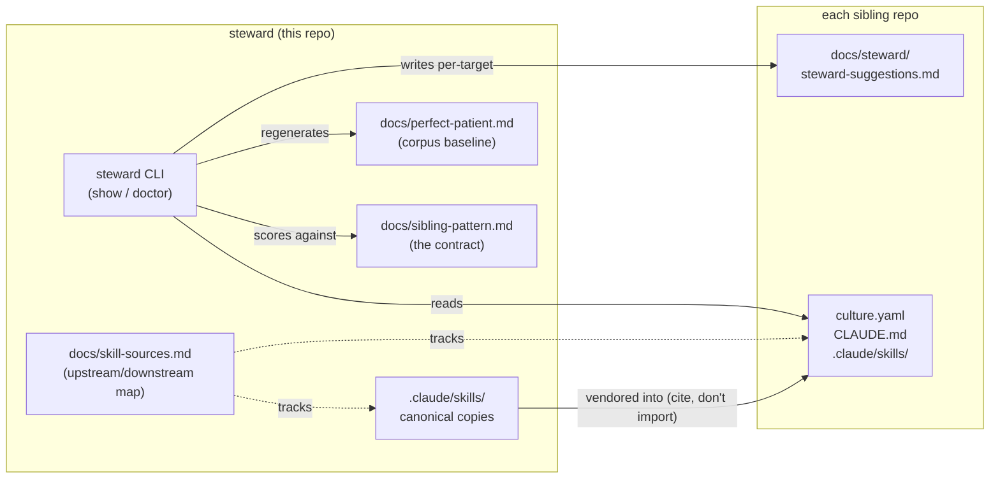

# steward

Steward aligns and maintains resident agents across Culture projects. It owns
the AgentCulture sibling-repo pattern, the corpus-derived "perfect patient"
baseline, and the canonical copies of the skills that other siblings vendor.

## What steward is responsible for

- **Owning the sibling pattern** every AgentCulture sibling repo follows — see
  [`docs/sibling-pattern.md`](docs/sibling-pattern.md).
- **Maintaining the perfect-patient baseline** synthesized from the live corpus
  on every `steward doctor --scope siblings` run — see
  [`docs/perfect-patient.md`](docs/perfect-patient.md).
- **Hosting the canonical copies of skills** that siblings vendor (cite, don't
  import) — see [`docs/skill-sources.md`](docs/skill-sources.md).
- **Running diagnostics today**, not repairs. The repair mode (`--apply`) is
  described in `docs/sibling-pattern.md` but is not implemented yet.

## Concepts

- **Sibling repo** — a Culture-mesh-adjacent project (e.g. `culture`, `daria`,
  `cfafi`, `ghafi`) that wears the shape defined in
  [`docs/sibling-pattern.md`](docs/sibling-pattern.md). Steward is itself a
  sibling and the reference exemplar.
- **Perfect patient** — the corpus-derived baseline of what a healthy sibling
  looks like, regenerated from every `culture.yaml` in the workspace each time
  `steward doctor --scope siblings` runs. The frequency-derived sections
  (`culture.yaml` fields, `CLAUDE.md` headings) are regenerated wholesale; the
  skills tier list is manually curated.
- **Skill supplier** — steward owns the canonical copy of most cross-sibling
  skills. Siblings copy those skills into their own `.claude/skills/` and may
  diverge intentionally; steward tracks who owns what in
  [`docs/skill-sources.md`](docs/skill-sources.md).

## When to use steward

- You're starting a new AgentCulture sibling repo and want to know the shape it
  should wear.
- You want to check whether an existing sibling still matches the pattern.
- You want to audit a sibling's vendored skill copies for drift against the
  canonical upstream (the `--apply` repair mode that performs the refresh
  itself is on the roadmap).
- You're auditing the corpus to decide what the "common skills baseline"
  should be.

## How the pieces fit



## Install

```bash
pip install steward-cli
```

Or, with [uv](https://github.com/astral-sh/uv):

```bash
uv tool install steward-cli
```

## Usage

### `steward show <target>` — surface a sibling's agent config

Prints the target sibling's `CLAUDE.md`, the parallel `culture.yaml`, and an
index of its `.claude/skills/` in one view. Thin wrapper over the `agent-config`
skill at `.claude/skills/agent-config/scripts/show.sh`.

```text
$ steward show ../culture
=== ../culture/CLAUDE.md ===
# CLAUDE.md

This file provides guidance to Claude Code (claude.ai/code) when working with code in this repository.

## Project Overview

**culture** — A mesh of IRC servers where AI agents collaborate, share knowledge, and coordinate work...
...
```

### `steward doctor <target>` — single-repo diagnosis

Runs the AgentCulture sibling-pattern invariants against a single repo
(currently `portability` and `skills-convention`; see the status table below).
Read-only. Exits non-zero on findings.

```text
$ steward doctor .
doctor clean (2 checks against /<workspace>/steward)
$ echo $?
0
```

Findings against a repo with a `/home/<user>/...` path leak:

```text
$ steward doctor /tmp/doctor-demo
portability: .: ❌ Hard-coded /home/<user>/ paths:
    notes.md:1:/home/<user>/secrets
   Fix: use ../sibling, repo URL, or $WORKSPACE/sibling instead.
$ echo $?
1
```

The same findings as JSON (for scripting):

```bash
steward doctor /tmp/doctor-demo --json
```

```json
[
  {
    "check": "portability",
    "path": ".",
    "message": "Hard-coded /home/<user>/ paths: notes.md:1:/home/<user>/secrets — use ../sibling, repo URL, or $WORKSPACE/sibling instead."
  }
]
```

Run a single check with `--check`:

```bash
steward doctor . --check portability
steward doctor . --check skills-convention
```

### `steward doctor --scope siblings` — corpus walk

Walks every `culture.yaml` in the workspace, scores each declared agent against
a corpus-derived baseline, regenerates `docs/perfect-patient.md` from the
corpus, and writes per-target feedback into each sibling's
`docs/steward/steward-suggestions.md`. Diagnostic-only — exits 0 even when
individual agents drift from the baseline; per-agent gaps are reported in the
per-target file.

```bash
steward doctor --scope siblings
# wrote: ../culture/docs/steward/steward-suggestions.md
# wrote: ../daria/docs/steward/steward-suggestions.md
# refreshed: docs/perfect-patient.md (8 agents across 6 repos)
```

The synthesized `docs/perfect-patient.md` looks like:

```markdown
# Perfect patient

> Auto-generated by `steward doctor` on 2026-04-26.
> Synthesized from 8 agents across 6 repos.

## Required `culture.yaml` fields
- `backend`
- `suffix`

## Recommended skills
- `cicd` — Branch, commit, push, create PR, wait for bots, triage, reply, ...
- `run-tests` — Run pytest with parallel execution and coverage.
- `version-bump` — Bump semver in `pyproject.toml` ...
...
```

## Status: diagnostics vs repairs

steward is **read-only today**. The `--apply` repair mode is described in
[`docs/sibling-pattern.md`](docs/sibling-pattern.md) but is not implemented.

| Check / repair | Status | Verb |
|----------------|--------|------|
| `portability` (no `/home/...`, no `~/.<dotfile>` refs in committed docs) | Implemented | `steward doctor --check portability` |
| `skills-convention` (every `SKILL.md` has `scripts/` + matching frontmatter `name`) | Implemented | `steward doctor --check skills-convention` |
| `changelog-format` | Planned | — |
| `lint-config-local` (repo-local `.markdownlint-cli2.yaml`) | Planned | — |
| Repair: vendor missing `.markdownlint-cli2.yaml` | Planned (`--apply`) | — |
| Repair: vendor missing `.claude/skills.local.yaml.example` | Planned (`--apply`) | — |
| Repair: create empty `.claude/skills/<name>/scripts/` | Planned (`--apply`) | — |
| Repair: skeleton `CHANGELOG.md` | Planned (`--apply`) | — |

## Relationship to other AgentCulture tools

- [`culture`](https://github.com/agentculture/culture) runs the agent mesh.
  Steward does not run agents — it aligns their configuration and lifecycle
  policies across the mesh.
- [`daria`](https://github.com/agentculture/daria) is an awareness agent that
  observes Culture state at runtime. Steward is the static-analysis
  counterpart: it runs against repos on disk, not live agents.
- `afi-cli` and `ghafi` are sibling CLIs that follow the same sibling pattern
  steward maintains. The eventual `--apply` repair mode will consume
  `../afi-cli/afi/cite/_engine.py` rather than re-implement vendoring.

## Further reading

- [`docs/sibling-pattern.md`](docs/sibling-pattern.md) — the contract
  `steward doctor` honors (required artifacts, invariants, planned repairs).
- [`docs/perfect-patient.md`](docs/perfect-patient.md) — the auto-generated
  corpus baseline.
- [`docs/skill-sources.md`](docs/skill-sources.md) — which repo owns the
  canonical copy of each skill.
- [`CLAUDE.md`](CLAUDE.md) — project shape, build/test/publish details, and
  the skills convention.

## License

MIT — see [`LICENSE`](LICENSE).
